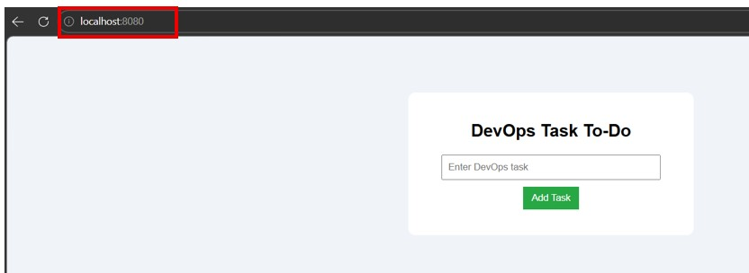

## To-Do Application✅🎯

## Group Information
- **Student 1:**  C.P.Imashi Fernando - ITBIN-2313-0033 - Role: Full-Stack Developer

- **Student 2:** W.J.Abisha - ITBIN-2313-0003 - Role: DevOps Engineer

## Project Description🔔📋
- Add new tasks with title and optional description  
- Edit / update existing tasks  
- Delete tasks instantly  
- Mark tasks as completed (with checkbox/strikethrough)  
- Reminder alerts for due/overdue tasks  
- Persistent storage via `localStorage`  
- Responsive design (mobile + desktop)  
- Clear all completed tasks  
- Filter tasks (all/active/completed)  
- Error handling and intuitive feedback  
Fully client-side – no backend, no login, no frameworks.

## Live Deployment🌍🔥
🔗🔗 **Live URL:** https://todo-app-devop-assignment.vercel.app/
## Output Screen Short(My App)


## Output Screenshot 📸

  
*Live view of the containerized To-Do app at http://localhost:8080 – tasks, reminders, and responsive UI working perfectly!*

## Technologies Used🛠️

- **Front-End**: HTML5, CSS3, Vanilla JavaScript (ES6+) – no frameworks  
- **Containerization**: Docker, Nginx (alpine), Docker Compose  
- **CI/CD & Automation**: GitHub Actions, GitHub Container Registry (GHCR)  
- **Hosting**: Vercel (static deployment) – Live: https://todo-app-devop-assignment.vercel.app/  
- **Version Control & Tools**: Git, GitHub, VS Code  
- **Testing**: Browser DevTools (Chrome, Firefox, Edge), Docker Scout (vulnerability scan)  
Lightweight, modern, and fully containerized stack for efficient DevOps deployment.

## Features✅

- Add, edit, delete, and mark tasks as completed  
- Reminder alerts for due/overdue tasks  
- Persistent storage via browser `localStorage`  
- Responsive, mobile-friendly UI  
- Intuitive feedback (success/error messages, animations)  
- Task filtering/sorting (active/completed/all)  
- Clear all completed tasks button  
- Basic dark/light mode toggle (optional)  
- Graceful error handling and validation  

## Branch Strategy🌿

We used a simple Git Flow-inspired branching model for organized and safe development:

- **`main`** – Production-ready (stable, deployable code only)  
- **`develop`** – Integration branch (latest WIP code before production)  
- **`feature/*`** – New features/tasks (e.g., `feature/docker-setup`) – merged to `develop` via PR  
- **`hotfix/*`** – Quick emergency fixes from `main` (merged back to `main` & `develop`)  
- **`release/*`** – Final release prep (optional, from `develop` to `main`)

**Benefits**:⚙️
- Protects `main` from direct commits  
- Allows parallel work without conflicts  
- Enables code reviews via pull requests  
- Supports easy rollbacks and fixes  
- Follows DevOps best practices for small teams  
All merges done through pull requests with descriptions and approvals.

## Individual Contributions👥✨


## [W.J Abisha] – My Contributions to the Assignment🐳🚀

As part of the Systems Administration and Maintenance (IT31023) group assignment, I handled the following key areas:

### Repository Setup and Configuration
- Created and organized the GitHub repository: https://github.com/Abisha71/Todo-App_Devop-Assignment
- Structured project folders:  
  - `src/` → All static frontend files (index.html, style.css, script.js)  
  - Root files: Dockerfile, docker-compose.yml, .dockerignore, README.md  
- Configured `.gitignore` and `.dockerignore` to exclude unnecessary files (node_modules, logs, temp files, screenshots, etc.) for clean builds and faster pushes 
- Initialized Git, made initial commits, and managed branches (`main`, `develop`, `feature/*`) for collaboration  
- Wrote and maintained the main README.md with setup instructions, Docker quick start, screenshots, challenges, and troubleshooting tips
- GitHub Actions CI/CD pipeline implementation
- Deployment setup and management
-Commit All  feature and code

### GitHub Actions CI/CD Pipeline Implementation⚠️
- Designed and implemented a CI/CD workflow for Docker builds  
- Created file: `.github/workflows/docker-build-push.yml`  
- Workflow features:  
  - Triggers on every push to `main` branch  
  - Automatically builds the Docker image using `nginx:alpine`  
  - Logs in to GitHub Container Registry (GHCR) using GITHUB_TOKEN  
  - Pushes the image with tags `:latest` and `:<commit-sha>`  
  - Uses GitHub Actions cache for faster builds
  - 
### [C.P. Imashi Fernando] – Key Contributions (ITBIN-2313-0033)💻🎨

Focused on front-end development and report refinement for the Systems Administration and Maintenance (IT31023) group assignment:

- Built the full original To-Do app using **HTML5**, **CSS3**, and **vanilla JavaScript** (no frameworks or libraries)  
- Implemented core features: add, edit, delete, and mark tasks as completed  
- Added reminder alerts/notifications for due or overdue tasks  
- Enabled task persistence using browser `localStorage`  
- Designed a clean, responsive, and user-friendly interface with proper CSS styling  
- Conducted cross-browser testing (Chrome, Firefox, Edge, Safari) and documented compatibility issues  
- Reviewed and provided feedback on technical sections (Docker architecture, performance optimization, security)  
- Suggested improvements to report structure, flow, grammar, and academic tone  


These efforts created the functional base application and significantly improved the overall quality and presentation of the final report.

## Setup Instructions
### Prerequisites
- **Node.js** (v18 or higher) – For running the development server (optional if using Docker only)  
- **Git** – To clone the repository  
- **Docker & Docker Compose** – Required for containerized run (recommended)  
  - Download & install Docker Desktop: https://www.docker.com/products/docker-desktop/  
  - Includes Docker Compose automatically  
- **Web Browser** – Chrome, Firefox, Edge, or Safari (for testing)  
- **Text Editor** – VS Code (recommended) or any code editor


## Setup Instructions
### Installation
```bash
# Clone the repository
git clone https://github.com/Abisha71/Todo-App_Devop-Assignment

# Navigate to project directory
cd Todo-App_Devop-Assignment

# Install dependencies
npm install

# Run development server
npm run dev

# Deployment Process
## Automated Deployment with GitHub Actions & Vercel

1. **Push to Repository**
   - Commit and push code changes to the `develop` or `main` branch
   - GitHub automatically triggers the CI/CD pipeline

2. **CI/CD Pipeline Execution**
   - GitHub Actions runs the workflow defined in `.github/workflows/ci.yml`
   - Steps include:
     - Install dependencies (`npm ci`)
     - Run linting (`npm run lint`)
     - Build the project (`npm run build`)
     - Run tests (`npm run test`)

3. **Deployment to Vercel**
   - On successful build, the application is automatically deployed to Vercel
   - Uses `VERCEL_TOKEN`, `VERCEL_ORG_ID`, and `VERCEL_PROJECT_ID` secrets
   - Deployment URL: https://todo-app-devop-assignment.vercel.app/

4. **Environment Variables**
   - Configure GitHub secrets in repository settings
   - Add Vercel deployment tokens for authentication

5. **Monitoring**
   - Monitor deployments in GitHub Actions tab
   - Check Vercel dashboard for deployment status and logs

## 🐳Todo App - Dockerized (Assignment 2)🐳

Static Todo application containerized using Docker & Docker Compose.

## Prerequisites
- Docker installed
- Docker Compose installed (usually comes with Docker Desktop)

## Quick Start (Recommended - using Docker Compose)
1. Install Docker Desktop (includes Docker Compose)
Windows: Download from https://www.docker.com/products/docker-desktop/ → Install → Enable WSL 2 during setup → Restart PC if asked.
Mac: Same link → Install → Open and let it finish setup.

2. Get the Project (Clone or download )
git clone https://github.com/Abisha71/Todo-App_Devop-Assignment.git
cd Todo-App_Devop-Assignment

3. Run the App (same command everywhere)
docker compose up --build -d

4. Open in Browser
Go to: http://localhost:8080
(Your To-Do app should load. If not → check docker compose logs for errors.)

5. Stop When DoneBash
docker compose down
   

**Screenshot:** Browser view of the containerized Todo application after `docker compose up --build -d`. This confirms static files are served correctly from the `src/` folder.

# Challenges Faced
The error while deployment ia very complex
## 🐳 Docker Setup

The application is containerized using **Nginx (alpine)** to serve static files efficiently.

### Dockerfile Highlights
- Uses lightweight `nginx:alpine` base image
- Copies static files from `src/` directory
- Exposes port 80

### docker-compose.yml
Single-service configuration for quick local development.


